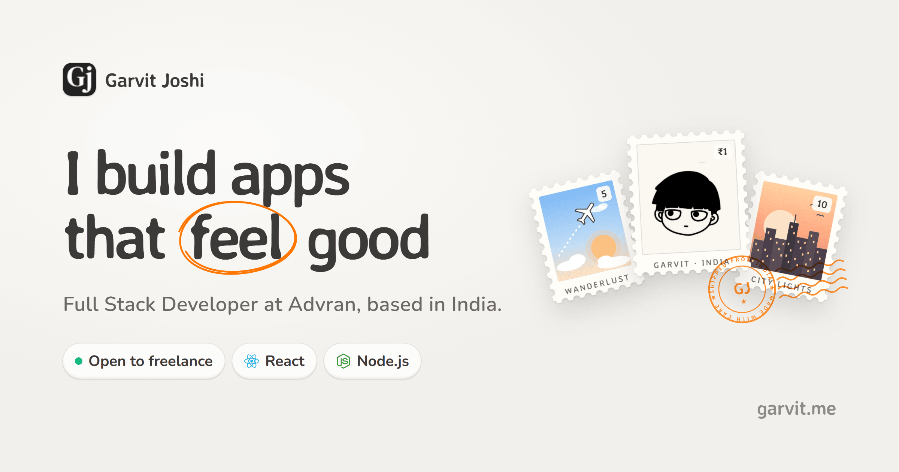

# Garvit Joshi · Portfolio

The personal site of **Garvit Joshi**, full stack developer. A warm, postal-themed portfolio with a small **Lab** of free tools people can use in their browser.

**Live:** [garvit.me](https://www.garvit.me/)



## What's inside

### Portfolio
- **Postage-stamp hero.** Perforated stamps drawn in pure CSS (two masks unioned), a postmark with curved ring text, and a hand-drawn scribble that circles a word as it scrolls into view.
- **Projects** with brand-coloured tech pills and 1200px WebP screenshots.
- **How I work** cards with illustrated SVG visuals, a **GitHub card**, and an **experience timeline** with company logos.
- **Air-mail postcard** contact section with a handwritten address and a "REPLY PAID" postmark.
- **UI sounds** on every button and link through one delegated listener, with a mute toggle.
- One single theme: warm off-white paper, charcoal ink, Averia Sans Libre headings and rounded body type.

### Lab
Free tools that run entirely in the browser. No sign-up and nothing uploaded.

- **Postmarked** (`/lab/stamp`). Turn a trip photo into an engraved postage stamp, postmarked from where and when it was taken.
  - **Engraving:** the photo is redrawn as one-ink line engraving (carmine, ultramarine, olive, sepia or black), with auto-levels and partial histogram equalisation so dark photos keep their detail.
  - **Self-postmarking:** the capture date and GPS are read from the photo's EXIF in the browser, and the place name comes from an offline list of about 370 cities (`src/data/places.js`). Both are editable, and photos without location data ask you to type it.
  - **Tear to download:** drag the stamp off the sheet and it rips free with a synthesised paper-tear sound, then saves as a 900 × 1140 PNG with transparent perforations.
  - **Sheets:** add up to six photos for a sheet of stamps that share perforations, each with its own postmark.

Lab pages are lazy-loaded, so they add nothing to the homepage bundle.

## Tech stack

| | |
|---|---|
| Framework | React 19, React Router 7 |
| Build | Vite 8 |
| Styling | Tailwind CSS 3 with CSS variables |
| Icons | Hugeicons, Simple Icons (CDN) |
| Scrolling | Lenis |
| Analytics | Vercel Analytics and Speed Insights |

## Getting started

Requires **Node 20.19+** (or 22.12+).

```bash
git clone https://github.com/Garvit1000/portfolio-main.git
cd portfolio-main
npm install
npm run dev
```

The dev server runs at <http://localhost:5173>.

### GitHub card (optional)

With a token, the GitHub card shows the full contribution graph. Without one, it falls back to the public API and shows repo, follower and account-age stats.

```env
# .env
VITE_GITHUB_TOKEN=your_github_personal_access_token
```

A classic token with no scopes is enough, since it only reads public data. Note that `VITE_` variables are bundled into the client, so never give this token write access.

## Scripts

| Command | What it does |
|---|---|
| `npm run dev` | Start the dev server |
| `npm run build` | Production build into `dist/` |
| `npm run preview` | Serve the production build locally |

## Project structure

```
src/
├── App.jsx                 # Routes: /, /lab, /lab/og-image (others redirect home)
├── index.css               # Design tokens, surfaces, buttons, stamps, postcard
├── data/mock.js            # All portfolio content: bio, projects, experience, links
├── components/
│   ├── Hero.jsx, HeroStamps.jsx, stamp-art.jsx   # Hero, stamps, postmark, stamp artwork
│   ├── Projects.jsx, About.jsx, Experience.jsx, Contact.jsx
│   ├── Scribble.jsx        # Hand-drawn circle highlight
│   ├── SocialLinks.jsx, TechPill.jsx, GitHubCard.jsx
│   └── SoundProvider.jsx   # UI sounds
├── pages/
│   ├── Lab.jsx             # Lab index (tool cards)
│   └── StampTool.jsx       # Postmarked: stamp tool UI and tear-off interaction
├── data/places.js          # Offline city list for turning GPS into a place name
└── lib/
    ├── stamp-render.js     # Engraving, stamp layout, postmark and sheet renderer
    ├── exif.js             # Minimal EXIF reader (capture date + GPS)
    ├── tear-sound.js       # Synthesised paper-tear sound
    └── sound-engine.js …   # Synthesised UI sounds
```

## Editing content

Almost everything you'd want to change lives in [`src/data/mock.js`](src/data/mock.js): name, title, bio, projects (with images in `src/assets/`), work experience (with logos in `src/assets/logos/`) and social links.

Project screenshots should be about 1200px wide WebP files. Anything larger is wasted, because cards render at around 560px.

## Adding to the Lab

To add a new tool, create a page in `src/pages/`, add a lazy route in `App.jsx`, and add an entry (with a `Preview` component for the card) to the `TOOLS` array in [`src/pages/Lab.jsx`](src/pages/Lab.jsx).

## Deployment

Deployed on Vercel. `vercel.json` rewrites all routes to `index.html` so deep links like `/lab/og-image` work on refresh.

When you change `public/og-image.png`, bump the `?v=` query on the `og:image` URLs in `index.html`. Link previews on Discord, Slack and LinkedIn are cached by URL.

## License

MIT. See [LICENSE](LICENSE).

## Contact

**Garvit Joshi** · [garvitjoshi543@gmail.com](mailto:garvitjoshi543@gmail.com) · [LinkedIn](https://linkedin.com/in/garvit-joshi1) · [GitHub](https://github.com/Garvit1000) · [X](https://x.com/Garvit1000)
